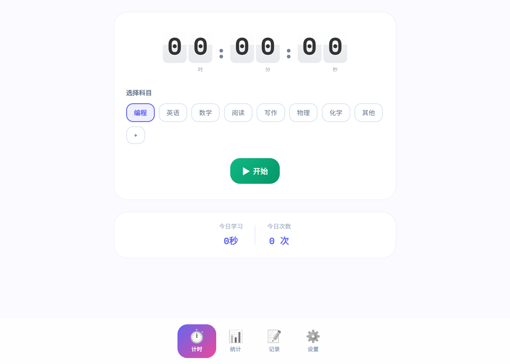
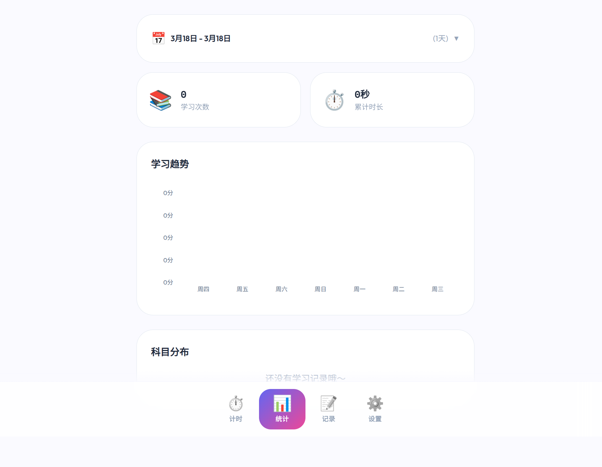
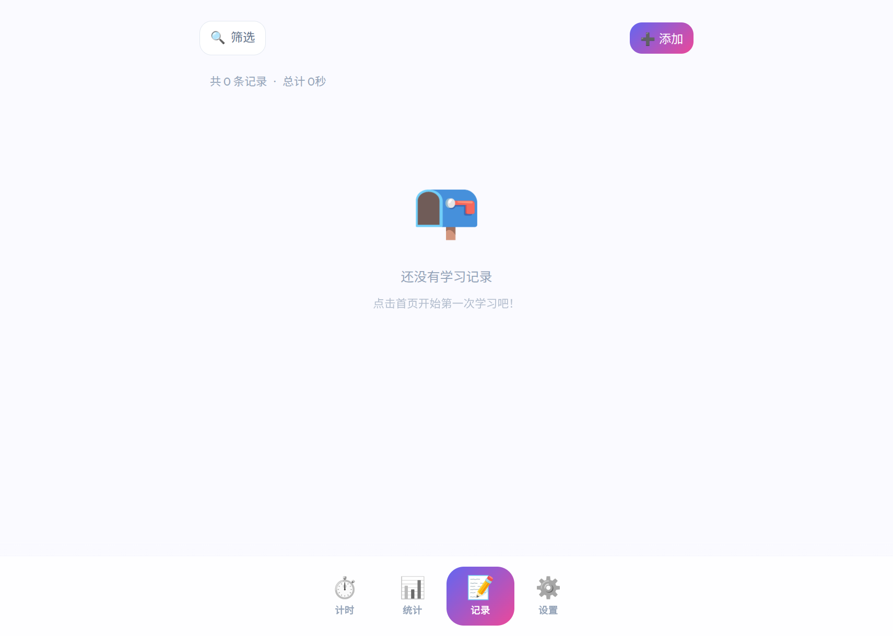

# 📚 学习追踪器

一个简洁优雅的学习时间追踪应用，帮助你记录和统计学习时间。

## ✨ 功能特性

- ⏱️ **计时器** - 开始/暂停/保存学习时长，支持后台运行
- 📊 **统计** - 查看学习趋势图表和科目分布饼图
- 📝 **记录** - 管理学习记录，支持添加/删除/筛选
- 🏷️ **自定义科目** - 添加/删除科目标签，自动分配颜色
- 📱 **PWA 支持** - 可安装到手机桌面
- 🔔 **后台计时** - 应用后台运行时继续计时

## 📥 安装

### Android

从 [Releases](https://github.com/xuzhangheng917/study-tracker/releases) 页面下载最新 APK 文件安装。

### 网页版

访问在线版本：**https://xuzhangheng917.github.io/study-tracker/**

## 🛠️ 技术栈

- **前端框架**: React 18
- **构建工具**: Vite 5
- **UI 组件**: Ant Design Mobile
- **图表**: Recharts
- **移动端**: Capacitor
- **PWA**: vite-plugin-pwa

## 📋 开发

```bash
# 安装依赖
npm install

# 开发模式
npm run dev

# 构建生产版本
npm run build

# 构建 Android APK
npm run build
npx cap copy android
cd android && ./gradlew assembleDebug
```

## 📸 截图

<div align="center">
  
  
  
</div>

## 📝 更新日志

### v1.7.41
- ✅ 修复后台计时不停止问题
- ✅ 修复时区问题（正确显示东8区时间）
- ✅ 长按删除科目标签
- ✅ 添加记录弹窗优化
- ✅ 统计图表优化

## 📄 许可证

MIT License

---

Made with ❤️ by [xuzhangheng917](https://github.com/xuzhangheng917)